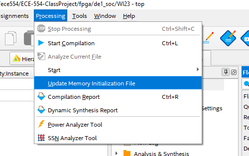
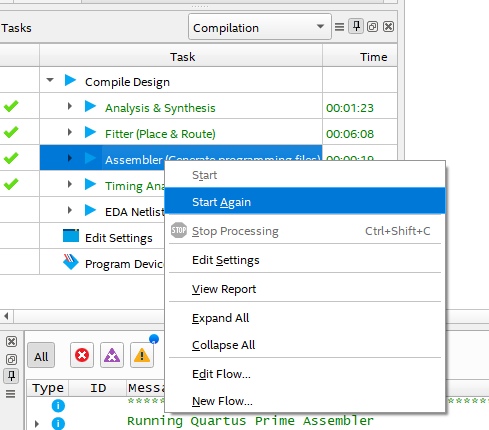

## Building requirements

All of the mentioned programs should be in `$PATH`.

* `make`
* `python3`
* Modelsim: `vsim`
* Quartus executables: `quartus_sh`, `quartus_pgm`

## How to build

* To build a SOF file for the DE1-SoC: `make fpga`
* To simulate all testbenches: `make sim`
* To simulate a specific testbench called `MyTB` (see [Repository Structure](#repository-structure)): `make sim TB=MyTB`
* To open the modelsim GUI for `MyTB`: `make gui TB=MyTB`

## I can't use the scripts. Where do I go?

* To open the quartus project: Double click the `*.qsf` in `fpga/de1_soc`.
    * Make sure the assembly file you want is built and placed in `out/out.hex`. See below simulation steps for building asm files.
* To simulate MiniLab0:
    * Create the ModelSim project manually. Add `tb/MiniLab0/MiniLab0_tb.sv` to the project. Add all of the files in `rtl/` (the design files) to the project.
    * Create `out/` in the root of the repository if it does not already exist.
    * From the root of the repository, run `python3 sw/assemble.py fw/MiniLab0.asm -o out/out.hex`.
    * Start simulation with `MiniLab0_tb` as the toplevel and run.

## Building Firmware

The Makefile has options for building either unit test cases (assembly or C) or the full calculator firmware project.  All firmware build types will place an ELF executable, a Verilog HEX file, and a dissassembly log in `out/`. 

These rely on having accesss to not only GNU make, but also the WI23 toolchain, which are both installed on the CAE machines (add `/filespace/d/decastelnau/pub/wi23-elf/bin` to your PATH.) The source code for the WI23 toolchain can be found at https://github.com/panther03/wi23-gcc/tree/master.

* If you run `make fw`, it will build the calculator firmware, located in `fw/calc`.
* If you run `make fw UNIT=x`, it will build the unit test with the filename x. If x ends in ".asm" or ".s" then it will look for it in `fw/unit/asm`, and if it ends in ".s" then `fw/unit/c`. Anything else is considered an error.

## Fast FPGA iteration

Some scripts have been setup to enable quick(er) iteration of firmware when testing on the FPGA. That is, if you have not made changes to the Verilog and only want to refresh the contents of the instruction memory, you can use this method. These require that you have access to a system with Make and the toolchain installed (e.g. CAE machines, which you should be using to compile the firmware anyway.) The following steps describe this process, assuming you have already compiled the latest Verilog design once in Quartus, and that your firmware has similarly been compiled with e.g. `make fw`. So, there should be an `out/out.elf` in the out directory.

1. Run `make fpga_mif` in the terminal.
2. Click the "Update Memory Initialization Files" button in Quartus:

3. Wait for the job to finish, then rerun specifically the Assembler task (don't start the whole thing over!):

4. Reprogram your FPGA.
5. Profit.
